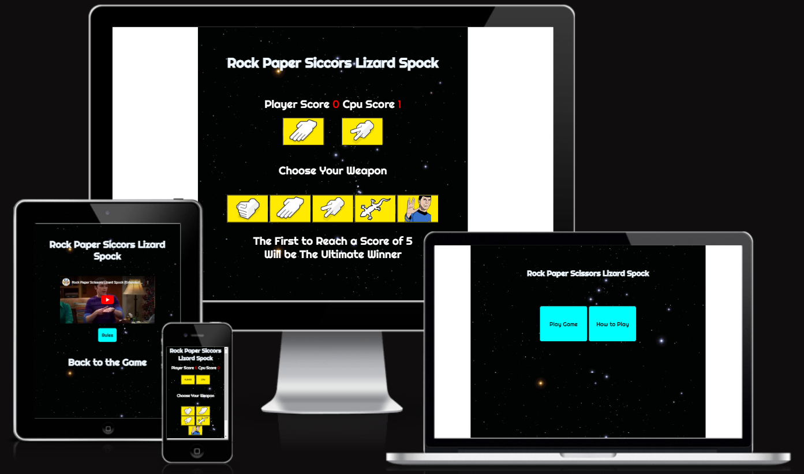
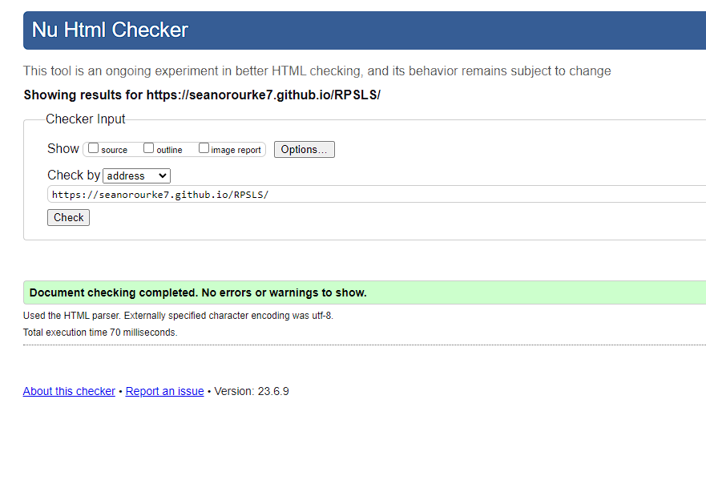

# RPSLS

This site is to host a game called Rock Paper Scissors Lizard Spock. This game was made popular by the TV show 'Big Bang theory'.

I built it to demonstrate the abilities I have learned so far, and for course evaluation.

This is a multi page site with links to each page. It contains a Home, Game, How to Play (with video) and Rules Page with text explaining the rules.

The site is responsive across different screen sizes.

https://seanorourke7.github.io/RPSLS/

---

## CONTENTS

- [RPSLS](#rpsls)
  - [CONTENTS](#contents)
  - [User Experience (UX)](#user-experience-ux)
    - [User Stories](#user-stories)
  - [Design](#design)
    - [Colour Scheme](#colour-scheme)
    - [Typography](#typography)
    - [Imagery](#imagery)
    - [Wireframes](#wireframes)
  - [Features](#features)
    - [General features on each page](#general-features-on-each-page)
    - [Future Implementations](#future-implementations)
    - [Accessibility](#accessibility)
  - [Technologies Used](#technologies-used)
    - [Languages Used](#languages-used)
    - [Deployment](#deployment)
      - [How to Fork](#how-to-fork)
      - [How to Clone](#how-to-clone)
  - [Testing](#testing)
  - [Bugs](#bugs)
  - [Credits](#credits)
    - [Content](#content)
    - [Media](#media)
    - [Acknowledgments](#acknowledgments)

---

## User Experience (UX)

### User Stories

First time visitors will be greeted by a clean homepage with clear information.

The header has the name of the game and in the centre are two buttons. 'How to Play' and 'Play Game'.

Both buttons react on hover to invite interaction.

The 'How to Play' page has a video embedded that explains the rules of the game. Underneath the video is a link "back to the game" which redirects the user to the game. The header links back to the homepage.

If for any reason the video doesn't load or isn't used there is a 'Rules' button underneath the video that opens a new page with text instructions on how the game works.

The Game page is laid out in an intuitive way with five buttons representing the users choice and animated text inviting the user to 'Choose a Weapon'.

Once the user interacts with the game and 'Chooses a Weapon' the cpu will automatically generate a counter weapon. Both weapons are displayed side by side above the buttons. An alert box and a sound will let the user know if they have won, lost or drawn. This alert also explains the reason ie:"Rock crushes Scissors".

A score display will increment scores for the player and the CPU. This is located above the display area for the user and cpu choices. Once a score of 5 is reached a winner is declared and the game restarts.

The logo at the top of the page will react on hover and bring the user to the home page.

There are sound alerts unique to each button and a different sound will play if the player wins, loses or draws.

## Design

### Colour Scheme

The colour scheme is based on the background image of the orion nebula in keeping with the link to Spock/Star Trek.

It works well in this case as its dark colour allows for simple and easy to read font colors and helps the buttons to stand out with bright yellow colours.

### Typography

I've used Righteous font as it is easy to read while also retaining a sci-fi look.

This means I can use it across the site and keep the flow of the site intact.

### Imagery

Images used are a selection of hand poses to symbolise rock paper and scissors and cartoon images of a lizard and spock. I chose the images of the hands due to their strong graphic appearance and bright yellow background and then edited the lizard and spock images to have the same yellow colour to make them appear more as a set.
The hand images were designed by Sacha Jerrems on Dribbble.com.

### Wireframes

I drew out a very simple wireframes with mockflow.
The structure changed as I went through the process of developing the game as I had originally intended on having only 1 page. It became quickly apparant that this wouldn't work stylistically so I spread it out to 4 pages. The core concept remained the same although I changed the layout of the buttons from the top to the bottom as it looked better on testing to have the display above the users input rahter than below.

## Features

This site contains a home page with 2 buttons directing the user to the game or to instructions.

A game page that hosts the game.

A How to Play page with a video embedded that explains the rules.

A Rules page with text explaining the rules.

### General features on each page

There is a header that is consitant across the site and in the 'Game' and 'How to Play' pages it contains a link back to the home page.

### Future Implementations

I would like to add more sounds and some movement in the buttons.

### Accessibility

All buttons with images have aria labels with descriptive text.
The font and colour scheme work well and accessability on lighthouse is 100%.

## Technologies Used

Github - To save and store the files for the website.

Codeanywhere - to write the code.

Google Fonts - To import the fonts used on the website.

SweetAlerts2 - for the alert boxes.

Google Dev Tools - To troubleshoot and test features, solve issues with responsiveness and styling.

Tiny PNG To compress images.

Am I Responsive? To show the website image on a range of devices.

Mockflow for the wireframe.

The sounds were sourced from https://www.mediacollege.com/downloads/sound-effects/star-trek/tos/

### Languages Used

HTML & CSS & JavaScript.

### Deployment

Deployment

Github Pages was used to deploy the live website. The instructions to achieve this are below:

Log in (or sign up) to Github.
Find the repository for this project, seanorourke7/RPSLS.
Click on the Settings link.
Click on the Pages link in the left hand side navigation bar.
In the Source section, choose main from the drop down select branch menu. Select Root from the drop down select folder menu.
Click Save. Your live Github Pages site is now deployed at the URL shown.

#### How to Fork

How to Fork
To fork the RPSLS repository:

Log in (or sign up) to Github.
Go to the repository for this project, seanorourke7/RPSLS.
Click the Fork button in the top right corner.

#### How to Clone

How to Clone
To clone the RPSLS repository:

Log in (or sign up) to GitHub.
Go to the repository for this project, seanorourke7/RPSLS.
Click on the code button, select whether you would like to clone with HTTPS, SSH or GitHub CLI and copy the link shown.
Open the terminal in your code editor and change the current working directory to the location you want to use for the cloned directory.
Type 'git clone' into the terminal and then paste the link you copied in step 3. Press enter.

## Testing

Testing was ongoing throughout the entire build. I utilised Chrome developer tools while building to pinpoint and troubleshoot any issues as I went along.

I didn't manage to make an any appointments with my Mentor for this project but I was able to troubleshoot on slack and through general google searches.

Originally I had the checkanswer function in 1 page that was extremly long. I split it into 2 seperate pages but on feedback from my prject submission I refactored the code to reduce the amount of repetition and put it all back into one page. 

I had several friends/family test the game and made changes based on their feedback. The biggest changes were to add sounds, to create a winning finish line, ie: first to 5, and to move the selection tiles below the result tiles to make it more visually appealing.

## Bugs

When checking Javascript Validator JsHint, I got several errors referencing the use of 'let' to declare a variable. I changed these to 'var'.

I also got an error about declaring a 'var' outside a funtion which led me to realise that I had the game start without listening for the DOM to be loaded and the initial code was not written into an enclosed fuction. So I re-wrote the initial code into a function that listens for the DOM to be loaded.

There is an error appearing around using 'template literal syntax' as its not available in versions before 2015 but I left these as I don't have an alternative fix at the moment and the issue will only appear on versions before 2015.

There is an error that the 'Swal' is not defined. I have't fixed this yet.

No bugs were identified in HTML or CSS validators.

## Credits

Most of what I learned for this project came from the Love-Maths , and Love-Running projects from code institute.
I used slack, youtube and other online resources to help with some code queries.

The Alert box code was sourced from SweetAlert2

### Content

The site was written by me and is for educational purposes only.

### Media

The hand images were designed by Sacha Jerrems on Dribbble.com ans the spock and lizard images were edited by me to fit the color scheme and were sourced from google images.

### Acknowledgments

I didn't have a chance to have a mentor session for this project but I did manage to get on a couple of the weekly meetups on slack which helps to motivate and keep me working through any issues.
The readme template was used from code insitute.
And the Slack community for this project is a great help for community discorse and feedback.

https://seanorourke7.github.io/RPSLS/

---
